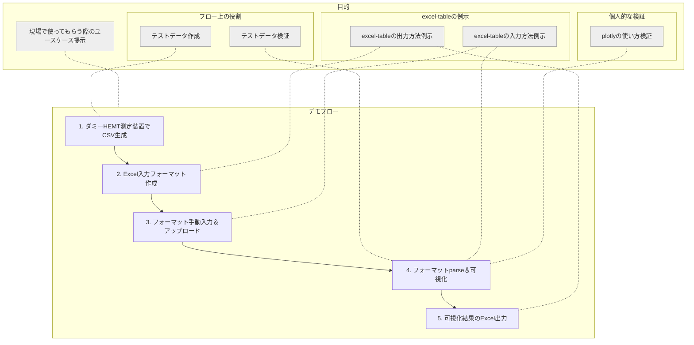

## 全体フロー

```mermaid
flowchart TB
    classDef comment fill:#eee,stroke:#999,color:#333;

    %% --- デモフロー ---
    subgraph demoflow["デモフロー"]
        step1["1. ダミーHEMT測定装置でCSV生成"]
        step2["2. Excel入力フォーマット作成"]
        step3["3. フォーマット手動入力＆アップロード"]
        step4["4. フォーマットparse＆可視化"]
        step5["5. 可視化結果のExcel出力"]

        step1 --> step2
        step2 --> step3
        step3 --> step4
        step4 --> step5
    end

    %% --- 目的 ---
    subgraph purposes["目的"]
        show_usecase["現場で使ってもらう際のユースケース提示"]:::comment

        subgraph forflow["フロー上の役割"]
            gen_tdat["テストデータ作成"]:::comment
            gen_tdat -..- step1

            test_result["テストデータ検証"]:::comment
            test_result -..- step4
        end

        subgraph et["excel-tableの例示"]
            test_out["excel-tableの出力方法例示"]:::comment
            test_out -..- step2
            test_out -..- step5

            test_in["excel-tableの入力方法例示"]:::comment
            test_in -..- step3
            test_in -..- step4
        end

        subgraph ind["個人的な検証"]
            htu_plotly["plotlyの使い方検証"]:::comment
            htu_plotly -..- step4
        end
    end
    show_usecase -..- demoflow

```